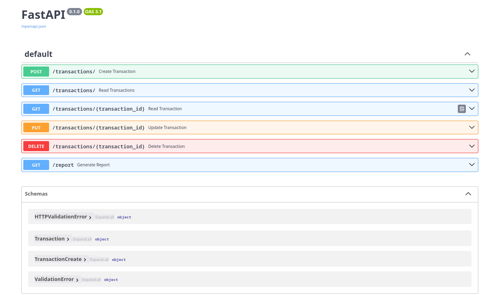

# FastAPI Financial Transactions Application

This project is a FastAPI-based web application designed to handle financial transactions. It includes CRUD operations for managing transactions, and also generates a financial report with a visual representation of the data.

## Overview

We developed this project as part of our class to apply the knowledge we gained, particularly in Python, FastAPI, and SQLAlchemy. It was a significant challenge to coordinate our group effort, but we aimed to incorporate as many concepts from our course as possible.

## Features

- **Create Transactions:** Add new financial transactions to the database.
- **Read Transactions:** Retrieve a list of transactions with optional pagination.
- **Update Transactions:** Modify existing transactions (newly added).
- **Delete Transactions:** Remove transactions from the database (newly added).
- **Generate Reports:** Generate and save a financial report as an image.

## Installation

1. Clone the repository:
   ```bash
   git clone https://github.com/nicodigos/final-group-project.git
   cd final-group-project
   pip install -r requirements.txt```


## Swagger UI docs

